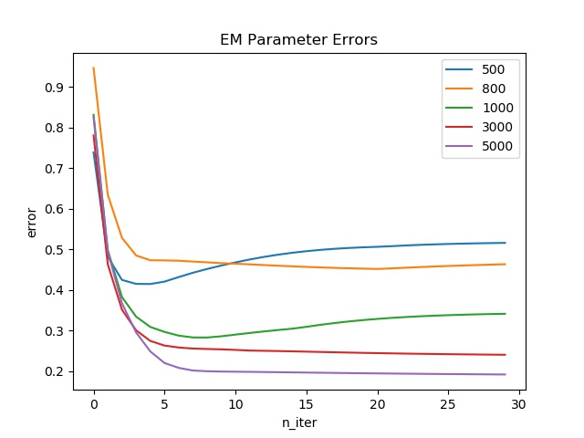
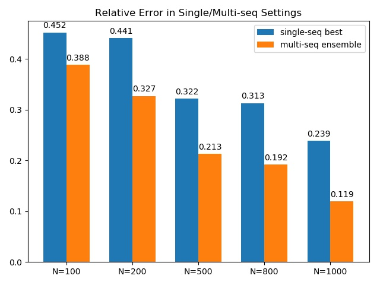

# SJTU-CS488 Project
## Simulation & Estimation of Multivariate Hawks Process

### Requirements
```
python3
numpy=1.15.4
matplotlib=3.0.2
tqdm=4.28.1
```

### Simulation 
Run simulation.py to generate a sequence of 20 events. It will print images to show the intensity of each dimension.
```bash
python simulation.py --max_num=20
```

### Estimation 

#### Single-Seq Setting
Estimate the parameters using a sequence of 1000 events.   
You will get the optimized parameters with relative error around 0.28.

```bash
python estimation.py --max_num=1000
```

You will get relative error around **0.19** using a sequence of 5000 events.
```bash
python estimation.py --max_num=5000
```
You can also set the max_num as 100, 500, 1000, 3000, 5000. Results are as follow.

#### Multi-Seq Setting
Estimate the parameters using multiple sequence by taking average of parameters in each run.
```bash
python multi_estimation.py --max_num=1000
```
Finally, you will get a relative error about **0.118**

